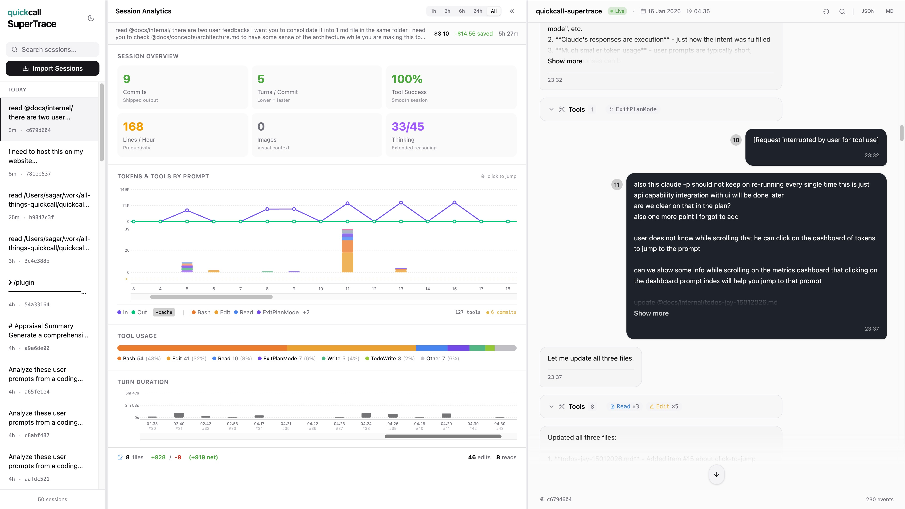

<p align="center">
  
</p>

<h3 align="center">SuperTrace - Monitor your AI coding sessions</h3>

<p align="center">
  <em>See what your AI assistant is doing. Track inputs, outputs, and tool calls in real-time.</em>
</p>

<p align="center">
  <a href="https://quickcall.dev"></a>
  <a href="https://discord.gg/DtnMxuE35v"></a>
  <a href="https://pypi.org/project/quickcall-supertrace/"></a>
</p>

<p align="center">
  <a href="#install">Install</a> |
  <a href="#features">Features</a> |
  <a href="#context-window-tracking-optional">Context Tracking</a> |
  <a href="#configuration">Configuration</a> |
  <a href="#docker">Docker</a> |
  <a href="#troubleshooting">Troubleshooting</a>
</p>

---

<p align="center">
  
</p>

---

## Install

```bash
curl -fsSL https://quickcall.dev/supertrace/install.sh | sh
```

Then run:
```bash
quickcall-supertrace
```

Open http://localhost:7845 in your browser.

> SuperTrace reads directly from Claude Code's JSONL transcript files at `~/.claude/projects/`. No hooks or configuration needed.

> **100% Local** - All data stays on your machine. Nothing is sent to any external servers.

## Features

- **Real-time monitoring** - Watch AI assistant inputs/outputs as they happen
- **Session timeline** - Browse all your coding sessions
- **Conversation view** - See user prompts, assistant responses, and tool calls
- **Full-text search** - Find anything across all sessions
- **Export** - Download sessions as JSON or Markdown
- **WebSocket updates** - Live updates without page refresh
- **Context window tracking** - Real-time context usage with color-coded progress bar

## Context Window Tracking (Optional)

Enable real-time context window tracking by configuring Claude Code hooks.

### Setup

Add this to your Claude Code settings (`~/.claude/settings.json`):

```json
{
  "hooks": {
    "Stop": [
      {
        "matcher": "*",
        "hooks": [
          {
            "type": "command",
            "command": "quickcall-supertrace-hook stop",
            "timeout": 5
          }
        ]
      }
    ]
  }
}
```

Then restart Claude Code to load the hooks.

### What It Does

The hook captures context window usage after each Claude response:
- **Green bar** - Under 50% usage (plenty of context remaining)
- **Yellow bar** - 50-75% usage (context filling up)
- **Red bar** - Over 75% usage (nearing context limit)

### Available Hook Commands

| Command | Event | Description |
|---------|-------|-------------|
| `quickcall-supertrace-hook stop` | Stop | Captures context after Claude responds |
| `quickcall-supertrace-hook tool` | PostToolUse | Captures context after each tool call |

### Environment Variables

| Variable | Default | Description |
|----------|---------|-------------|
| `QUICKCALL_SUPERTRACE_URL` | http://localhost:7845 | Server URL |
| `QUICKCALL_SUPERTRACE_DEBUG` | false | Enable debug logging |

### How It Works

1. Claude Code calls `quickcall-supertrace-hook` after each response
2. The hook reads token usage from the session transcript
3. Calculates context window percentage
4. POSTs data to SuperTrace server
5. Frontend displays real-time progress bar

No external dependencies required - the hook CLI is bundled with `quickcall-supertrace`.

## Dashboard Metrics

### Hero Metrics (6-Panel Grid)

| Metric | Description |
|--------|-------------|
| **Commits** | Git commits made during the session |
| **Turns / Commit** | Average prompts per commit (lower = faster delivery) |
| **Tool Success Rate** | Percentage of tool calls that completed successfully |
| **Lines / Hour** | Net lines changed per hour (productivity metric) |
| **Images** | Total images/screenshots shared in the session |
| **Thinking** | Prompts with extended thinking enabled (e.g., "3/10") |

### Cost Analysis

| Metric | Description |
|--------|-------------|
| **Estimated Cost** | Total USD cost based on Claude API pricing |
| **Input Cost** | Cost for context/input tokens |
| **Output Cost** | Cost for generated tokens |
| **Cache Savings** | Money saved from prompt caching |

### Token Metrics (Per-Turn Chart)

- **Input Tokens** - Context sent per prompt
- **Output Tokens** - Tokens generated in response
- **Cache Read Tokens** - Tokens read from cache
- **Cache Creation Tokens** - Tokens written to cache
- **Turn Duration** - Time per prompt/response cycle

### Tool Usage

- **Tool Distribution** - Breakdown by tool type (Read, Edit, Bash, etc.)
- **Total Tools** - Number of tool calls
- **Tools Per Turn** - Stacked visualization of tools used

### Work Output

| Metric | Description |
|--------|-------------|
| **Files Changed** | Unique files modified |
| **Lines Added** | Lines of code added |
| **Lines Removed** | Lines of code removed |
| **Net Lines** | Net change (added - removed) |
| **Files Read** | Files read for context |

### AI Insights

- **Session Intents** - AI-detected goals for the session
- **Intent Changes** - Whether focus shifted during work

### Time Filtering

All metrics support time range filtering: **1h**, **2h**, **6h**, **24h**, **All**

## Configuration

| Env Variable | Default | Description |
|--------------|---------|-------------|
| `QUICKCALL_SUPERTRACE_PORT` | 7845 | Server port |
| `QUICKCALL_SUPERTRACE_HOST` | 127.0.0.1 | Server host |

## Docker

```bash
docker compose up -d
```

## Troubleshooting

### Port Already in Use

```bash
QUICKCALL_SUPERTRACE_PORT=8080 quickcall-supertrace
```

### Reset Database

```bash
rm -rf ~/.quickcall-supertrace
```

### Stop the Server

```bash
# Foreground: Ctrl+C
# Background: pkill -f quickcall-supertrace
```

---

<p align="center">
  Built with care by <a href="https://quickcall.dev">QuickCall</a>
</p>
