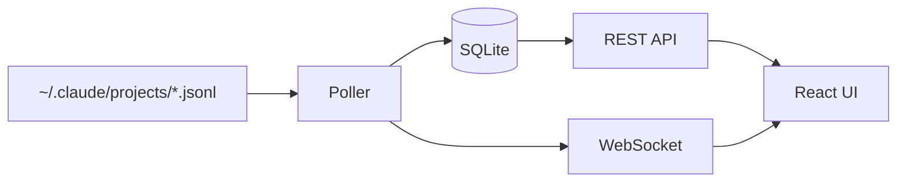

# QuickCall SuperTrace Documentation

> Session monitoring and analytics dashboard for Claude Code

QuickCall SuperTrace automatically captures Claude Code sessions from JSONL transcript files and provides real-time analytics including token usage, costs, tool metrics, and timing analysis.

## Quick Reference

| What | Where |
|------|-------|
| Server | `packages/server/` - FastAPI backend |
| Frontend | `packages/web/` - React dashboard |
| Database | `~/.quickcall-supertrace/data.db` (SQLite) |
| Source data | `~/.claude/projects/*/*.jsonl` |
| Default ports | Server: 7845, Frontend: 2255 |

## Documentation Structure

```
docs/
├── getting-started/     # Setup and first run
│   ├── installation.md  # Prerequisites and install steps
│   └── quickstart.md    # 5-minute guide to first session
├── concepts/            # How things work
│   └── architecture.md  # System design and data flow
├── guides/              # Task-oriented how-tos
│   ├── distribution.md  # Build, package, and publish
│   ├── export-sessions.md
│   ├── token-usage.md
│   └── file-suggestion.md
└── reference/           # Technical specifications
    ├── api.md           # REST API endpoints
    └── configuration.md # Environment variables and schema
```

## Start Here

1. **[Installation](getting-started/installation.md)** - Install server and frontend
2. **[Quick Start](getting-started/quickstart.md)** - View your first session
3. **[Architecture](concepts/architecture.md)** - Understand data flow

## Key Features

- **Zero configuration** - Reads existing Claude Code JSONL files automatically
- **Real-time updates** - WebSocket-based live session monitoring
- **Rich analytics** - Token costs, tool usage, timing metrics, charts
- **Session export** - JSON and Markdown formats
- **Full-text search** - Search across all session content

## How It Works



QuickCall SuperTrace polls Claude Code's transcript files, parses messages, computes metrics, and serves them via REST API with real-time WebSocket updates.

## For LLMs

When helping users with QuickCall SuperTrace:

- **No hooks required** - The system reads JSONL files directly, no Claude Code configuration needed
- **Sessions appear automatically** - After ~2 minutes of Claude Code activity
- **Manual import available** - Click "Import Sessions" in UI or `POST /api/ingest`
- **Database location** - `~/.quickcall-supertrace/data.db` (SQLite with WAL mode)
- **Logs** - Server outputs to stdout, check terminal running `quickcall-supertrace`

Common troubleshooting:
- Sessions not appearing → Check if `~/.claude/projects/` has JSONL files
- Empty metrics → Session may be too new, wait for assistant responses
- Port conflict → Change with `QUICKCALL_SUPERTRACE_PORT=8080`
