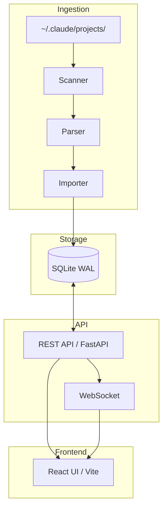
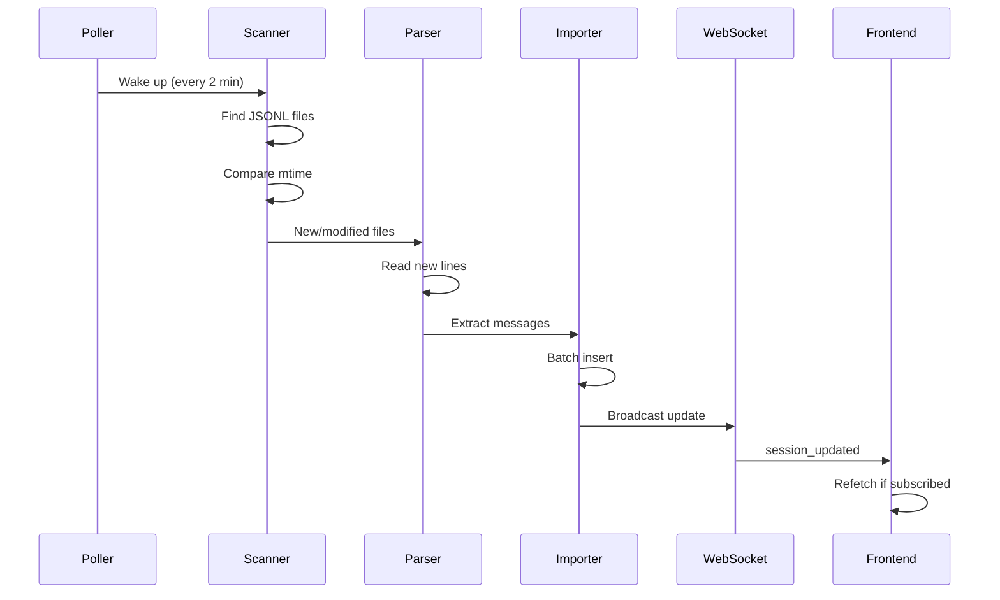
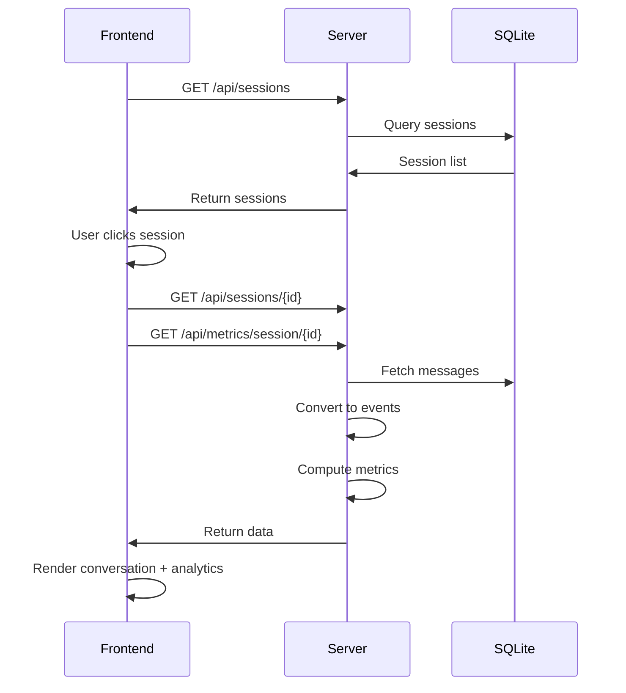

# Architecture

How QuickCall SuperTrace captures and displays Claude Code sessions.

## System Overview



## Components

### 1. Data Source: Claude Code JSONL Files

Claude Code writes all interactions to JSONL files at `~/.claude/projects/{project-hash}/{session-id}.jsonl`.

Each line is a JSON object representing a message:

```jsonl
{"type":"summary","timestamp":"2026-01-14T10:00:00Z","summary":"Started session"}
{"type":"user","message":{"content":"Hello"},"timestamp":"2026-01-14T10:00:05Z"}
{"type":"assistant","message":{"content":[...],"usage":{...}},"timestamp":"2026-01-14T10:00:10Z"}
```

### 2. Ingestion Pipeline

**Scanner** (`packages/server/quickcall_supertrace/ingest/scanner.py`)
- Finds all JSONL files in `~/.claude/projects/`
- Returns file metadata (path, mtime, size)
- Sorted by modification time (newest first)

**Parser** (`packages/server/quickcall_supertrace/ingest/parser.py`)
- Parses JSONL lines into structured `ParsedMessage` objects
- Extracts: prompt text, token usage, tool names, model, timestamps
- Preserves raw JSON for future reprocessing

**Importer** (`packages/server/quickcall_supertrace/ingest/importer.py`)
- Batch inserts parsed messages into SQLite
- Supports incremental imports (only new lines)
- Deduplicates by message UUID

**Poller** (`packages/server/quickcall_supertrace/ingest/poller.py`)
- Background task running every 120 seconds
- Scans for new/modified files
- Triggers incremental imports
- Broadcasts updates via WebSocket

### 3. Database (SQLite)

Location: `~/.quickcall-supertrace/data.db`

**Tables:**

| Table | Purpose |
|-------|---------|
| `sessions` | Session metadata (id, project_path, timestamps) |
| `messages` | Parsed JSONL messages with extracted fields |
| `transcript_files` | Tracks ingested files (mtime, byte offset) |
| `session_metrics` | Pre-computed aggregates |
| `messages_fts` | Full-text search index |

**Key Design Decisions:**
- WAL mode for concurrent reads during writes
- Denormalized fields in `messages` for query performance
- FTS5 for full-text search across content

### 4. REST API (FastAPI)

**Routes:**

| Endpoint | Purpose |
|----------|---------|
| `GET /api/sessions` | List sessions (paginated) |
| `GET /api/sessions/{id}` | Get session with events |
| `GET /api/sessions/{id}/export` | Export as JSON/Markdown |
| `GET /api/metrics/session/{id}` | Compute session metrics |
| `POST /api/ingest` | Trigger manual import |
| `GET /api/ingest/status` | Show tracked files |
| `WS /ws` | Real-time updates |

### 5. Metrics System

**Architecture:** Decorator-based plugin system

```python
@metric(category=MetricCategory.TOKENS, format=MetricFormat.CURRENCY)
def estimated_cost(events: PreprocessedEvents) -> float:
    # Compute cost from token counts
```

**Categories:**
- TOKENS: Input/output counts, cache stats, costs
- TOOLS: Tool usage counts, success rates
- TIMING: Session duration, response times
- INTERACTION: Prompt count, edits per prompt
- CHARTS: Token trends, tool distribution

**Preprocessing:** Single-pass extraction of commonly-needed data for efficiency.

### 6. React Frontend

**Tech Stack:** React 19, TypeScript, Tailwind CSS, Vite

**Three-Panel Layout:**

| Panel | Width | Description |
|-------|-------|-------------|
| SessionList | 256px | Sidebar with search |
| AnalyticsPanel | collapsible | Metrics dashboard |
| SessionView | flex-1 | Conversation display |

**Key Components:**
- `SessionList` - Sidebar with session search and import
- `AnalyticsPanel` - Expandable metrics dashboard with charts
- `SessionView` - Conversation display with infinite scroll
- `ToolGroup` - Collapsible tool usage display
- `MessageBubble` - Event rendering (user/assistant/tools)

**Real-time:** WebSocket connection for live updates when sessions change.

## Data Flow

### Import Flow



### Query Flow



### Event Types

Events displayed in frontend are converted from raw messages:

| Raw Message Type | Display Event Type |
|------------------|-------------------|
| `user` | `user_prompt` |
| `assistant` | `assistant_stop` + `tool_use` events |
| `summary` | `session_start` |

Tool uses are extracted from assistant message content blocks.

## Database Schema

```sql
CREATE TABLE sessions (
    id TEXT PRIMARY KEY,
    project_path TEXT,
    started_at TEXT,
    ended_at TEXT,
    git_branch TEXT,
    cwd TEXT
);

CREATE TABLE messages (
    id INTEGER PRIMARY KEY,
    session_id TEXT NOT NULL,
    uuid TEXT UNIQUE,
    msg_type TEXT,           -- user, assistant, summary
    timestamp TEXT,
    prompt_text TEXT,        -- extracted from user messages
    model TEXT,              -- claude-opus-4, etc.
    input_tokens INTEGER,
    output_tokens INTEGER,
    cache_read_tokens INTEGER,
    cache_create_tokens INTEGER,
    tool_use_count INTEGER,
    tool_names TEXT,         -- JSON array
    raw_data TEXT,           -- full JSON for reprocessing
    FOREIGN KEY (session_id) REFERENCES sessions(id)
);

CREATE TABLE transcript_files (
    path TEXT PRIMARY KEY,
    session_id TEXT,
    mtime REAL,
    last_byte_offset INTEGER
);
```

## Configuration

| Variable | Default | Description |
|----------|---------|-------------|
| `QUICKCALL_SUPERTRACE_PORT` | `7845` | Server port |
| `QUICKCALL_SUPERTRACE_HOST` | `127.0.0.1` | Server bind address |
| `QUICKCALL_SUPERTRACE_ENABLE_POLLER` | `true` | Enable background polling |
| `QUICKCALL_SUPERTRACE_POLL_INTERVAL` | `120` | Poll interval in seconds |
| `QUICKCALL_SUPERTRACE_MEDIA_DIR` | `~/.quickcall-supertrace/media` | Image storage |

## Security Considerations

- **Localhost only** - Server binds to 127.0.0.1 by default
- **No authentication** - Assumes local, single-user environment
- **Read-only source** - Never modifies Claude Code files
- **Data sensitivity** - Transcripts may contain sensitive code/data

## Performance

- **Poll interval**: 120s (configurable)
- **Incremental import**: Only new lines processed
- **Database**: SQLite WAL mode for concurrent access
- **Metrics**: Pre-computed during import, cached
- **Frontend**: Virtual scrolling for large sessions

## Extending

1. **New metrics**: Add decorated function in `metrics/` module
2. **Export formats**: Add to `routes/sessions.py`
3. **Search**: Extend FTS5 queries
4. **Storage**: Replace SQLite with PostgreSQL for multi-user

## See Also

- [API Reference](../reference/api.md) - Endpoint documentation
- [Configuration](../reference/configuration.md) - All config options
