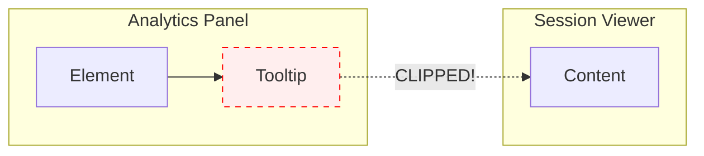
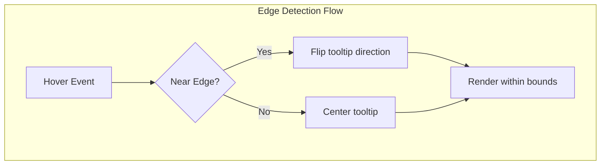

# Tooltip & Hover Design Guidelines

## The Problem

SuperTrace uses a multi-panel layout with resizable panels. Each panel has `overflow-hidden` to prevent layout issues during resize and refresh operations. This **clips any tooltip or hover content that extends beyond panel boundaries**.

The most common failure point is near the **right edge of the Analytics Panel** where it meets the Session Viewer.



## The Solution

All tooltip and hover content MUST be contained within panel bounds using **edge detection**.



## Required Pattern

### 1. Edge Detection

Before showing a tooltip, calculate if it would overflow the panel boundary:

```typescript
// Calculate tooltip position relative to container
const containerWidth = containerRef.current?.clientWidth || 400;
const tooltipX = elementX;
const tooltipWidth = 180; // Estimated tooltip width

// Check if tooltip would overflow right edge
const nearRightEdge = tooltipX + tooltipWidth / 2 > containerWidth - 10;

// Flip tooltip direction when near edge
const transform = nearRightEdge ? 'translateX(-100%)' : 'translateX(-50%)';
```

### 2. Reference Implementation

See `PromptMetricsChart.tsx` for the canonical example of a custom tooltip with edge detection:

```typescript
{hoveredTurn && (() => {
  const tooltipWidth = 140;
  const containerWidth = scrollRef.current?.clientWidth || 400;
  const tooltipX = yAxisWidth + hoveredX - scrollLeft;
  const nearRightEdge = tooltipX + tooltipWidth / 2 > containerWidth - 10;

  return (
    <div
      className="absolute pointer-events-none z-20 bg-popover ..."
      style={{
        left: tooltipX,
        top: tokenChartHeight + gapHeight + 8,
        transform: nearRightEdge ? 'translateX(-100%)' : 'translateX(-50%)',
      }}
    >
      {/* tooltip content */}
    </div>
  );
})()}
```

### 3. Smart Tooltip Component

For simpler use cases, use the `Tooltip` component in `ExpandedView.tsx` which includes automatic edge detection:

```tsx
<Tooltip text="Your tooltip text">
  <span>Hover me</span>
</Tooltip>
```

This component:
- Uses `data-panel="analytics"` attribute to find the parent panel
- Calculates available space on left and right
- Automatically adjusts position (center, left-anchored, or right-anchored)

## Required Classes

All tooltips MUST include:

| Class | Purpose |
|-------|---------|
| `pointer-events-none` | Prevents tooltip from blocking interactions |
| `z-20` or higher | Ensures tooltip appears above content |
| `absolute` | Required for positioning within relative container |
| `whitespace-nowrap` OR `max-w-[Xpx]` | Controls tooltip width |

## DO NOT

1. **Use CSS-only tooltips** near panel edges without edge detection
2. **Assume tooltips can overflow** into adjacent panels
3. **Use `position: fixed`** - breaks with scrolling containers
4. **Forget `pointer-events-none`** - causes hover flickering
5. **Use `z-index: 9999`** - use reasonable values like `z-20` to `z-50`

## Panel Data Attributes

Panels should include a `data-panel` attribute for tooltip edge detection:

```tsx
<div data-panel="analytics" className="...">
  {/* Panel content */}
</div>
```

The `Tooltip` component uses `trigger.closest('[data-panel="analytics"]')` to find the panel boundaries.

## Testing

When adding new tooltips, test:

1. Hover on elements **near the right edge** of the panel
2. Hover on elements **near the left edge** of the panel
3. Resize the panel and verify tooltips still work
4. Scroll within the panel and verify tooltip positioning
