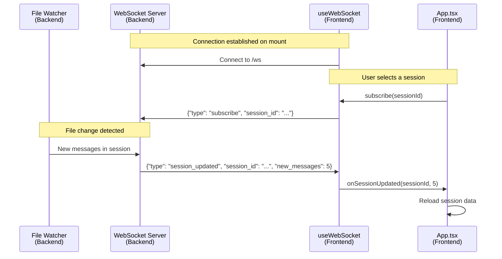
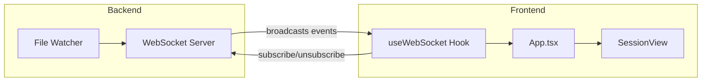

# WebSocket Session Subscriptions

## Overview

SuperTrace uses WebSocket connections for real-time session updates. This eliminates the need for polling and provides near-instant updates when new messages arrive in active sessions.

## Architecture





## Backend Event Types

The backend broadcasts three event types. **These are the canonical event names** - the frontend must match these exactly.

### 1. `session_imported`

Sent when a new session file is discovered during file watching or manual import.

```json
{
  "type": "session_imported",
  "session_id": "abc123-def456-...",
  "is_new": true
}
```

**Frontend action:** Refresh the session list to show the new session.

### 2. `session_updated`

Sent when new messages are appended to an existing session file.

```json
{
  "type": "session_updated",
  "session_id": "abc123-def456-...",
  "new_messages": 5
}
```

**Frontend action:** If this is the currently selected session, reload its events and metrics.

### 3. `session_refreshed`

Sent after a manual refresh request via the API completes.

```json
{
  "type": "session_refreshed",
  "session_id": "abc123-def456-...",
  "new_messages": 3,
  "timestamp": "2025-01-15T10:30:00Z"
}
```

**Frontend action:** Same as `session_updated` - reload if currently viewing this session.

## Frontend Implementation

### Hook: `useWebSocket.ts`

The `useWebSocket` hook manages the WebSocket connection lifecycle:

```typescript
interface UseWebSocketOptions {
  onSessionImported?: (sessionId: string) => void;
  onSessionUpdated?: (sessionId: string, newMessages: number) => void;
}

export function useWebSocket(options: UseWebSocketOptions = {}) {
  // ... connection management
  return { isConnected, subscribe };
}
```

### Usage in App.tsx

```typescript
// Define handlers
const handleSessionImported = useCallback(async (sessionId: string) => {
  // Refresh session list
  const data = await getSessions();
  setSessions(data.sessions);
}, []);

const handleSessionUpdated = useCallback(async (sessionId: string, newMessages: number) => {
  // Always refresh session list
  const data = await getSessions();
  setSessions(data.sessions);

  // If viewing this session, reload its data
  if (sessionId === selectedSessionId) {
    const [sessionData, metricsData] = await Promise.all([
      getSession(sessionId, 30),
      getSessionMetrics(sessionId, metricsHoursBack),
    ]);
    setSelectedSession(sessionData.session);
    setEvents(sessionData.events);
    setMetrics(metricsData.metrics);
  }
}, [selectedSessionId, metricsHoursBack]);

// Connect WebSocket
const { isConnected, subscribe } = useWebSocket({
  onSessionImported: handleSessionImported,
  onSessionUpdated: handleSessionUpdated,
});

// Subscribe when session changes
useEffect(() => {
  if (selectedSessionId) {
    subscribe(selectedSessionId);
  }
}, [selectedSessionId, subscribe]);
```

## Client-to-Server Messages

The frontend sends subscription messages to receive targeted updates:

### Subscribe

```json
{
  "type": "subscribe",
  "session_id": "abc123-def456-..."
}
```

### Unsubscribe

```json
{
  "type": "unsubscribe",
  "session_id": "abc123-def456-..."
}
```

## Common Pitfalls

### 1. Event Type Mismatch

**Problem:** Frontend listens for different event names than backend sends.

```typescript
// WRONG - these don't match backend
if (data.type === 'new_event') { ... }
if (data.type === 'new_session') { ... }

// CORRECT - matches backend exactly
if (data.type === 'session_updated') { ... }
if (data.type === 'session_imported') { ... }
```

### 2. Callback Reference Changes

**Problem:** Passing inline callbacks causes reconnections on every render.

```typescript
// WRONG - creates new function reference each render
useWebSocket({
  onSessionUpdated: (id, count) => { ... }
});

// CORRECT - use refs internally to avoid reconnections
const onSessionUpdatedRef = useRef(onSessionUpdated);
onSessionUpdatedRef.current = onSessionUpdated;
```

### 3. Missing Re-subscription on Reconnect

**Problem:** After WebSocket reconnects, not re-subscribing to the current session.

```typescript
// The hook handles this internally
ws.onopen = () => {
  // Re-subscribe to session if we had one before reconnect
  if (subscribedSessionRef.current) {
    ws.send(JSON.stringify({
      type: 'subscribe',
      session_id: subscribedSessionRef.current
    }));
  }
};
```

## New Messages Indicator

When new messages arrive while the user is scrolled up, show a floating indicator:

```typescript
// Track if user is at bottom
const [isAtBottom, setIsAtBottom] = useState(true);
const [newMessageCount, setNewMessageCount] = useState(0);

// Scroll listener
const handleScroll = () => {
  const threshold = 100;
  const atBottom = container.scrollHeight - container.scrollTop - container.clientHeight < threshold;
  setIsAtBottom(atBottom);
  if (atBottom) setNewMessageCount(0);
};

// Track new messages when not at bottom
useEffect(() => {
  const newCount = events.length - prevEventCount;
  if (newCount > 0 && !isAtBottom) {
    setNewMessageCount(prev => prev + newCount);
  }
}, [events.length, isAtBottom]);
```

## Testing WebSocket Updates

1. Open SuperTrace in browser
2. Start a Claude Code session in terminal
3. Verify session appears in list without refresh
4. Select the session
5. Send messages in terminal
6. Verify messages appear in real-time
7. Scroll up in the session viewer
8. Send more messages
9. Verify "new messages" indicator appears

## Related Files

- `packages/web/src/hooks/useWebSocket.ts` - WebSocket connection hook
- `packages/web/src/App.tsx` - WebSocket usage and handlers
- `packages/web/src/components/SessionView.tsx` - New messages indicator
- Backend: WebSocket broadcast implementation (Python)
