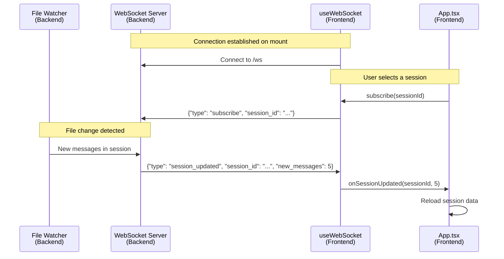
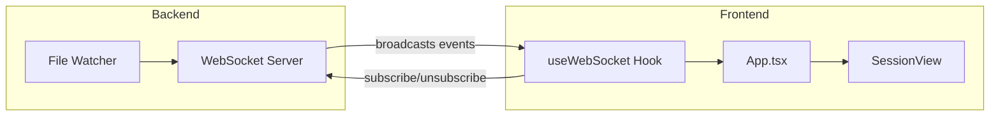

# WebSocket Session Subscriptions

## Overview

SuperTrace uses WebSocket connections for real-time session updates. This eliminates the need for polling and provides near-instant updates when new messages arrive in active sessions.

## Architecture





## Backend Event Types

The backend broadcasts three event types. **These are the canonical event names** - the frontend must match these exactly.

### 1. `session_imported`

Sent when a new session file is discovered during file watching or manual import.

```json
{
  "type": "session_imported",
  "session_id": "abc123-def456-...",
  "is_new": true
}
```

**Frontend action:** Refresh the session list to show the new session.

### 2. `session_updated`

Sent when new messages are appended to an existing session file.

```json
{
  "type": "session_updated",
  "session_id": "abc123-def456-...",
  "new_messages": 5
}
```

**Frontend action:** If this is the currently selected session, reload its events and metrics.

### 3. `session_refreshed`

Sent after a manual refresh request via the API completes.

```json
{
  "type": "session_refreshed",
  "session_id": "abc123-def456-...",
  "new_messages": 3,
  "timestamp": "2025-01-15T10:30:00Z"
}
```

**Frontend action:** Same as `session_updated` - reload if currently viewing this session.

## Frontend Implementation

### Hook: `useWebSocket.ts`

The `useWebSocket` hook manages the WebSocket connection lifecycle:

```typescript
interface UseWebSocketOptions {
  onSessionImported?: (sessionId: string) => void;
  onSessionUpdated?: (sessionId: string, newMessages: number) => void;
}

export function useWebSocket(options: UseWebSocketOptions = {}) {
  // ... connection management
  return { isConnected, subscribe };
}
```

### Usage in App.tsx

```typescript
// Define handlers
const handleSessionImported = useCallback(async (sessionId: string) => {
  // Refresh session list
  const data = await getSessions();
  setSessions(data.sessions);
}, []);

const handleSessionUpdated = useCallback(async (sessionId: string, newMessages: number) => {
  // Always refresh session list
  const data = await getSessions();
  setSessions(data.sessions);

  // If viewing this session, reload its data
  if (sessionId === selectedSessionId) {
    const [sessionData, metricsData] = await Promise.all([
      getSession(sessionId, 30),
      getSessionMetrics(sessionId, metricsHoursBack),
    ]);
    setSelectedSession(sessionData.session);
    setEvents(sessionData.events);
    setMetrics(metricsData.metrics);
  }
}, [selectedSessionId, metricsHoursBack]);

// Connect WebSocket
const { isConnected, subscribe } = useWebSocket({
  onSessionImported: handleSessionImported,
  onSessionUpdated: handleSessionUpdated,
});

// Subscribe when session changes
useEffect(() => {
  if (selectedSessionId) {
    subscribe(selectedSessionId);
  }
}, [selectedSessionId, subscribe]);
```

## Client-to-Server Messages

The frontend sends subscription messages to receive targeted updates:

### Subscribe

```json
{
  "type": "subscribe",
  "session_id": "abc123-def456-..."
}
```

### Unsubscribe

```json
{
  "type": "unsubscribe",
  "session_id": "abc123-def456-..."
}
```

## Common Pitfalls

### 1. Event Type Mismatch

**Problem:** Frontend listens for different event names than backend sends.

```typescript
// WRONG - these don't match backend
if (data.type === 'new_event') { ... }
if (data.type === 'new_session') { ... }

// CORRECT - matches backend exactly
if (data.type === 'session_updated') { ... }
if (data.type === 'session_imported') { ... }
```

### 2. Callback Reference Changes

**Problem:** Passing inline callbacks causes reconnections on every render.

```typescript
// WRONG - creates new function reference each render
useWebSocket({
  onSessionUpdated: (id, count) => { ... }
});

// CORRECT - use refs internally to avoid reconnections
const onSessionUpdatedRef = useRef(onSessionUpdated);
onSessionUpdatedRef.current = onSessionUpdated;
```

### 3. Missing Re-subscription on Reconnect

**Problem:** After WebSocket reconnects, not re-subscribing to the current session.

```typescript
// The hook handles this internally
ws.onopen = () => {
  // Re-subscribe to session if we had one before reconnect
  if (subscribedSessionRef.current) {
    ws.send(JSON.stringify({
      type: 'subscribe',
      session_id: subscribedSessionRef.current
    }));
  }
};
```

### 4. Tracking `events.length` for New Message Detection

**Problem:** Trying to detect new messages by comparing `events.length` in a child component.

```typescript
// WRONG - events.length stays at 30 due to pagination
useEffect(() => {
  if (events.length > lastSeenCount) {
    setHasNewMessages(true);
  }
}, [events.length]);
```

**Why it fails:** The API returns paginated results (e.g., latest 30 events). When new messages arrive, the API still returns 30 events—just shifted forward. The count never changes.

**Solution:** Track new messages at the parent level (App.tsx) where WebSocket `session_updated` events arrive, then pass `hasNewMessages` as a prop to child components. See [New Messages Indicator](#new-messages-indicator) below.

## New Messages Indicator

When new messages arrive while the user is scrolled up, show a floating "New messages" button.

### Why Not Track `events.length`?

The naive approach would be to track `events.length` changes in SessionView:

```typescript
// WRONG - doesn't work with pagination!
useEffect(() => {
  if (events.length > lastSeenCount && !isAtBottom) {
    setHasNewMessages(true);
  }
}, [events.length, isAtBottom]);
```

**This doesn't work** because the API returns paginated results (latest 30 events). When new messages arrive, the API still returns 30 events - just newer ones. So `events.length` stays at 30 and the effect never detects new messages.

### The Fix: Use WebSocket Signal from Parent

The solution is to track new messages at the **App.tsx level** where WebSocket events arrive, then pass that state down to SessionView as a prop.

#### 1. App.tsx - Track `hasNewMessages` state

```typescript
const [hasNewMessages, setHasNewMessages] = useState(false);

const handleSessionUpdated = useCallback(async (sessionId: string, newMessages: number) => {
  // Always refresh session list
  const data = await getSessions();
  setSessions(data.sessions);

  // If this is the currently selected session, signal new messages
  if (sessionId === selectedSessionId) {
    setHasNewMessages(true);  // <-- Signal to SessionView

    // Reload session data
    const [sessionData, metricsData] = await Promise.all([
      getSession(sessionId, 30),
      getSessionMetrics(sessionId, metricsHoursBack),
    ]);
    setSelectedSession(sessionData.session);
    setEvents(sessionData.events);
    setMetrics(metricsData.metrics);
  }
}, [selectedSessionId, metricsHoursBack]);

// Reset when switching sessions
useEffect(() => {
  setHasNewMessages(false);
  // ... rest of session loading
}, [selectedSessionId]);

// Pass to SessionView
<SessionView
  hasNewMessages={hasNewMessages}
  onClearNewMessages={() => setHasNewMessages(false)}
  // ... other props
/>
```

#### 2. SessionView.tsx - Receive props, track scroll position

```typescript
interface SessionViewProps {
  // ... other props
  hasNewMessages?: boolean;
  onClearNewMessages?: () => void;
}

export function SessionView({
  hasNewMessages = false,
  onClearNewMessages,
  // ... other props
}: SessionViewProps) {
  const [isAtBottom, setIsAtBottom] = useState(true);

  // Track scroll position
  const checkIfAtBottom = useCallback(() => {
    const container = scrollRef.current;
    if (!container) return true;
    const threshold = 100;
    return container.scrollHeight - container.scrollTop - container.clientHeight < threshold;
  }, []);

  useEffect(() => {
    const container = scrollRef.current;
    if (!container) return;

    const handleScroll = () => setIsAtBottom(checkIfAtBottom());
    handleScroll(); // Check initial position

    container.addEventListener('scroll', handleScroll);
    return () => container.removeEventListener('scroll', handleScroll);
  }, [checkIfAtBottom, session?.id, events.length]);

  // Scroll to bottom and clear indicator
  const scrollToBottom = useCallback(() => {
    scrollRef.current?.scrollTo({
      top: scrollRef.current.scrollHeight,
      behavior: 'smooth'
    });
    onClearNewMessages?.();
  }, [onClearNewMessages]);

  // Render button conditionally
  const isActive = session?.started_at && !session?.ended_at;

  return (
    // ...
    {!isAtBottom && (
      <div className="floating-button-container">
        {isActive && hasNewMessages ? (
          <button onClick={scrollToBottom}>
            New messages <DownArrowIcon />
          </button>
        ) : (
          <button onClick={scrollToBottom}>
            <DownArrowIcon />
          </button>
        )}
      </div>
    )}
  );
}
```

### Key Points

1. **WebSocket is the source of truth** - Only App.tsx knows when `session_updated` arrives
2. **Props flow down** - `hasNewMessages` comes from parent, not calculated locally
3. **Two button states**:
   - Active session + new messages: "New messages ↓" button
   - Just scrolled up (no new messages or inactive session): Simple "↓" arrow button
4. **Clear on scroll** - When user clicks button or scrolls to bottom, call `onClearNewMessages()`
5. **Reset on session change** - Clear `hasNewMessages` when switching to a different session

## Testing WebSocket Updates

1. Open SuperTrace in browser
2. Start a Claude Code session in terminal
3. Verify session appears in list without refresh
4. Select the session
5. Send messages in terminal
6. Verify messages appear in real-time
7. Scroll up in the session viewer
8. Send more messages
9. Verify "new messages" indicator appears

## Related Files

- `packages/web/src/hooks/useWebSocket.ts` - WebSocket connection hook
- `packages/web/src/App.tsx` - WebSocket usage and handlers
- `packages/web/src/components/SessionView.tsx` - New messages indicator
- Backend: WebSocket broadcast implementation (Python)
